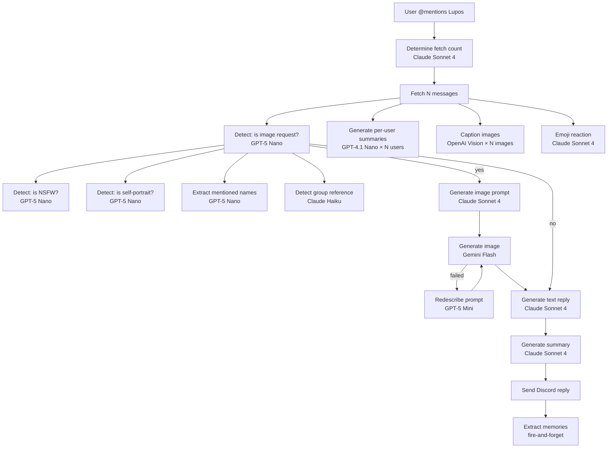
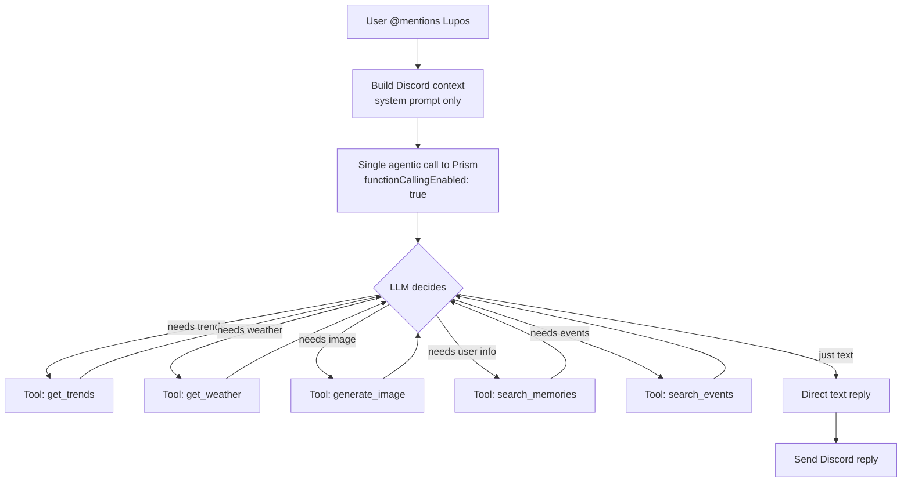

# Lupos → Prism Agentic Integration

Audit of Lupos's current AI flow and a proposal to replace its **orchestrated multi-call pipeline** with Prism's **server-side agentic loop**, making Lupos's replies smarter, cheaper, and more extensible.

---

## Current State: The Problem

Lupos currently runs a **client-side orchestration pattern** — a waterfall of **6–10+ separate LLM calls** per single Discord reply:



### Key Inefficiencies

| Issue | Impact |
|-------|--------|
| **6–10 sequential LLM calls** per reply | High latency (5–15s+ total), high cost |
| **Boolean classification via LLM** (is-image-request, is-NSFW, is-self-portrait) | ~3 LLM calls that could be a single tool-use decision |
| **Client-side fetch count optimization** | A full Claude Sonnet call to pick a number 5–100 |
| **No tool use** — Lupos manually fetches trends, events, weather, products | Hardcoded in `TrendsService`, injected into system prompt unconditionally |
| **Massive system prompt** (~8,000+ tokens) with static context | Trends, ISS position, wildfires, earthquakes — all pre-fetched regardless of relevance |
| **Image orchestration is manual** | Detect → prompt → generate → retry → caption — five separate calls |
| **No streaming** | Discord reply appears all at once after full pipeline completes |
| **Per-user conversation summaries** as separate LLM calls | N additional calls for N participants |
| **Duplicated context assembly** | Lupos builds its own system prompt; Prism's `SystemPromptAssembler` is unused |

---

## Proposed Architecture: Agentic Lupos via Prism

Replace the entire waterfall with a **single agentic call** to Prism's `/chat` endpoint with `functionCallingEnabled: true`. The LLM itself decides what tools to call and when.



### What Changes

| Before (Client Orchestrated) | After (Prism Agentic) |
|---|---|
| 6–10 LLM calls per reply | **1 agentic call** (1–3 LLM iterations internally) |
| Lupos manually detects image requests | LLM decides via tool schema |
| Lupos pre-fetches ALL trends/events/weather | LLM calls tools **only when relevant** |
| Lupos builds 8K+ token system prompt | Lean Discord-context prompt + tool schemas |
| No streaming | SSE streaming for Discord "typing" indicator |
| Manual image retry logic | Agentic retry via tool call loop |
| Separate emoji reaction call | Can be a tool or stay as-is (lightweight) |

### New Prism Endpoint: `/chat/agent` (or reuse `/chat` with `functionCallingEnabled`)

Lupos already has the plumbing — `PrismService._request()` and `PrismService.generateText()`. We need to:

1. **Add an agentic call method** to `PrismService` that sends `functionCallingEnabled: true` + the Discord-context system prompt
2. **Register Lupos-specific tools** in `tools-api` (image generation, Discord actions) or as custom tools in Prism
3. **Replace `buildAndGenerateReply()`** with a single agentic call

---

## Proposed Changes

### Phase 1: Lupos-Specific Tool Registration

Register Discord-aware tools that the agentic loop can invoke:

| Tool Name | Description | Replaces |
|-----------|-------------|----------|
| `generate_discord_image` | Generate an image from a text prompt, with optional reference images | Manual image orchestration in `buildAndGenerateReply` |
| `caption_image` | Caption/describe an image URL | `AIService.captionImages()` calls |
| `redescribe_image_prompt` | Creatively rewrite a rejected image prompt | `AIService.redescribeImagePrompt()` |

The existing tools-api tools (`get_trends`, `search_events`, `get_weather`, `search_products`, `get_earthquakes`, etc.) are **already registered** and will be available automatically via `ToolOrchestratorService`.

---

### Phase 2: PrismService Agentic Method

Add a new `generateAgenticReply()` method to `lupos/services/PrismService.js`:

```js
static async generateAgenticReply({
  messages,          // Discord conversation history
  systemPrompt,      // Discord context (server, channel, participants)
  type = "ANTHROPIC",
  model,
  username = "lupos",
  enabledTools,      // Subset of tools relevant to Discord context
  autoApprove = true, // Lupos auto-approves all tool calls
}) {
  const provider = PROVIDER_MAP[type];
  const body = {
    provider,
    model,
    messages,
    systemPrompt,
    functionCallingEnabled: true,
    enabledTools,
    autoApprove,
    skipConversation: true,
  };

  // Use SSE streaming to get real-time chunks
  return PrismService._requestStream(`/chat?stream=true`, { body, username });
}
```

This sends a **single request** that Prism's `AgenticLoopService` handles — tool calls, retries, and all.

---

### Phase 3: Refactor `buildAndGenerateReply()`

The current `buildAndGenerateReply()` (~1000 lines, L433–L1464 in `DiscordService.js`) would be dramatically simplified:

1. **Keep**: Discord context assembly (server info, participants, channel info, avatars, memories)
2. **Remove**: All boolean detection calls, image pipeline orchestration, manual trend injection
3. **Replace**: The final reply generation with a single `PrismService.generateAgenticReply()` call

The LLM will autonomously:
- Decide if image generation is needed (no more `isAskingToGenerateImage` call)
- Call `get_trends` only when the conversation is about current events
- Call `search_events` only when asking about local events
- Call `generate_discord_image` with the right prompt
- Handle image failures with `redescribe_image_prompt` + retry
- Generate the text reply in the same pass

---

### Phase 4: TrendsService Refactor

Currently, `TrendsService.getTrendingSummary()` fetches **8 different data sources** (trends, products, events, earthquakes, NEOs, space weather, ISS, wildfires) and dumps them **all** into **every** system prompt.

This would be entirely replaced by the agentic approach — the LLM calls `get_trends`, `get_weather`, `search_events`, etc. **only when relevant**.

The `TrendsService` can be removed from the reply flow entirely. It can remain as a standalone utility for scheduled reports.

---

## What Stays The Same

| Component | Reason |
|-----------|--------|
| `DiscordService` event handling | The message queue, event listeners, and Discord API interaction stay unchanged |
| Discord context assembly (participants, avatars, server info) | This is Discord-specific metadata that Prism shouldn't own |
| `CurrentService` (session tracking) | Still tracks the reply cycle |
| `MongoService` (metrics logging) | Still logs to MongoDB |
| Emoji reactions | Cheap Claude Haiku call, can stay separate or become a tool |
| Memory extraction (fire-and-forget) | Already async, stays post-reply |
| `LightsService` cycling | Ambient feedback, unrelated to AI flow |

---

## Cost & Latency Impact

### Estimated Cost Reduction

| Scenario | Before (calls × cost) | After (calls × cost) |
|----------|----------------------|---------------------|
| Simple text reply | ~4 calls ($0.008) | 1 call ($0.003) |
| Image generation | ~8–10 calls ($0.025) | 1–3 iterations ($0.010) |
| Image with retry | ~12 calls ($0.035) | 2–4 iterations ($0.015) |

> **~50–60% cost reduction** per reply through elimination of classification calls and selective tool use.

### Estimated Latency Reduction

| Scenario | Before | After |
|----------|--------|-------|
| Simple text reply | 4–8s | 2–4s |
| Image generation | 10–20s | 6–12s |

> **~40–50% latency reduction** since the agentic loop runs tool calls in parallel where possible, and eliminates sequential boolean detection.

---

## Design Decisions To Make

### Image Generation Tool Design
Should the image generation tool return the image inline (base64) so the agentic loop can inspect/retry, or should it return a reference that Lupos resolves later when building the Discord embed?

### Emoji Reactions
Currently a separate Claude Sonnet 4 call. Options:
1. Keep as a separate lightweight call (parallel with main reply)
2. Add as a `react_with_emoji` tool the LLM can call within the agentic loop
3. Move to a post-reply hook

### System Prompt Size
The current Discord context prompt is already ~8K tokens. Adding tool schemas (~2K more) means the agentic call will have a larger input. However, we're **removing** the ~3K tokens of unconditional trends/weather/ISS data that's currently injected, so it nets out to roughly the same.

### Streaming to Discord
Prism's agentic loop emits SSE chunks. Should Lupos:
1. Collect the full response then send (current behavior)
2. Stream to Discord with "typing" indicator + edit the message as chunks arrive
3. Hybrid — show typing indicator, send full message when done

### Tool Subset
Which tools should Lupos have access to? The full tools-api catalog has ~30+ tools. Should Lupos get all of them, or a curated subset?

### Model Choice
Currently the reply uses Claude Sonnet 4. For agentic mode, should we stick with Sonnet 4 or consider a model with stronger tool-use performance?

### Backward Compatibility
Should we implement this as a feature flag (`config.AGENTIC_MODE = true`) so we can A/B test?

### Custom Lupos Tools
Beyond `generate_discord_image`, are there other Discord-specific tools worth registering? (e.g., `lookup_user_profile`, `search_channel_history`, `manage_roles`)

---

## Verification Plan

### Automated Tests
- Update existing Lupos tests to mock `PrismService.generateAgenticReply()`
- Add integration test that validates tool schema registration in tools-api
- Test fallback behavior when tools-api is unreachable

### Manual Verification
- A/B test in the testing guild (`GUILD_ID_TESTING`) with feature flag
- Compare response quality, latency, and cost between old and new flows
- Verify image generation works end-to-end through the agentic loop
- Confirm memory extraction still fires post-reply
